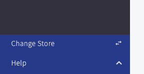
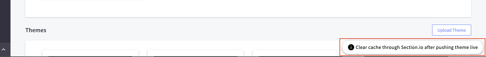

BC_Dev_Customizations.js: Requires 'ScriptAutoRunner' chrome extension

      Installation: 

            1. Install ScriptAutoRunner Chrome Extension
            
            2. Add the following script and enable

      Theme page quicklink (tested on all versions of cornerstone)
      

      Moves 'Change Store' button fixed to bottom of sidebar

      
      Removes that pesky admin bar
      

      Add custom note/reminder to themes page per site

debugContext.js: (local environment only)

      Installation:

            1. right click bookmarks bar

            2. add page

            3. replace url with the code in debugContext.js

      Context property quick search browser bookmark (?debug=context)
        -click once to open new window with the context data
        -click again and it opens the quick lookup tool

